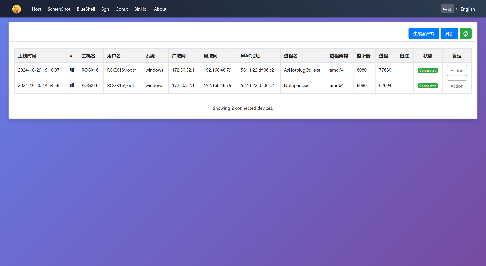
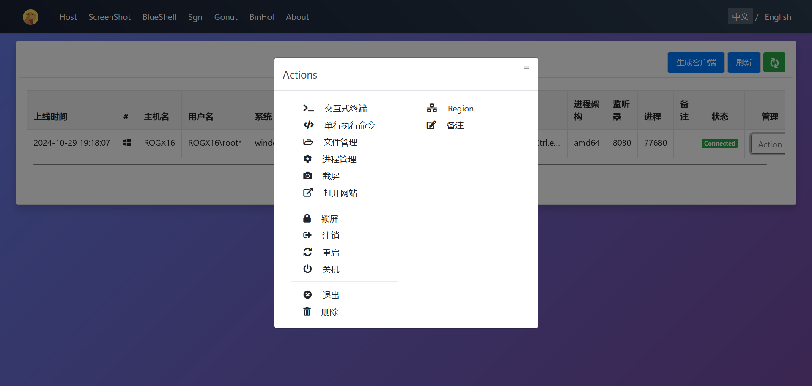
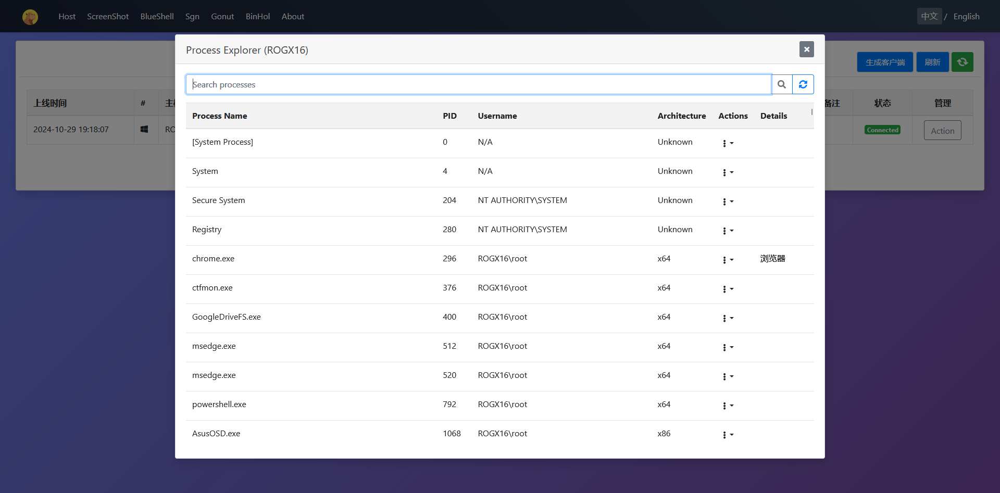
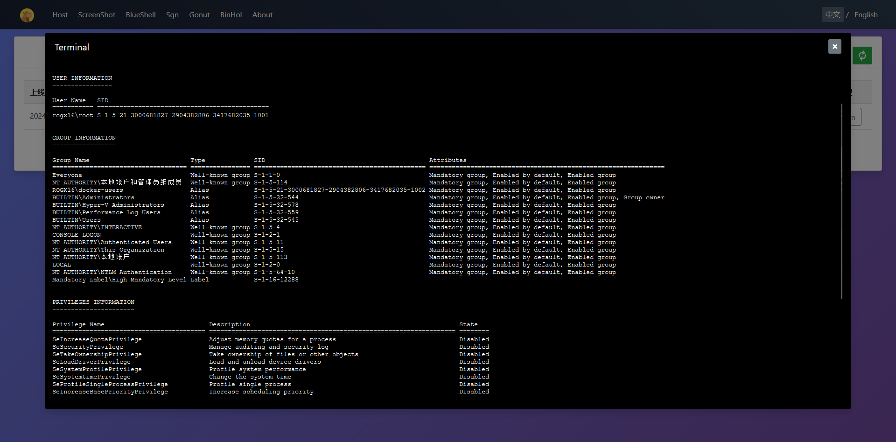
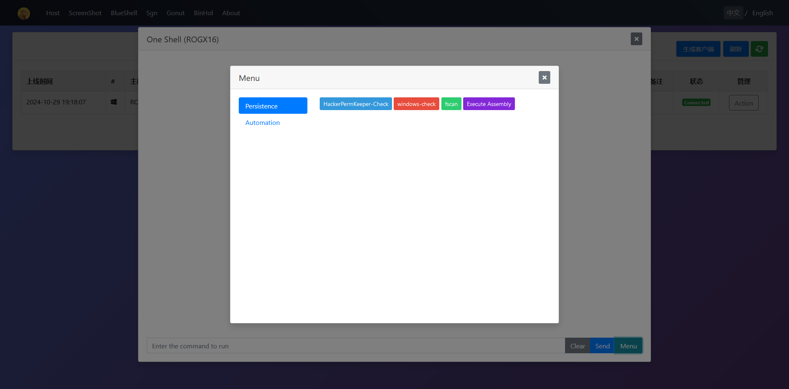
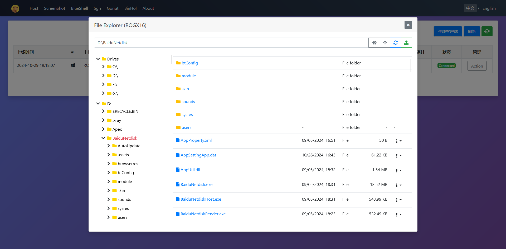

# AC2_DEMO

自研C2 功能展示。cs+spark的结合体。省去了本地客户端，便于团队操作。

## 主页

## 功能

1. 中英切换
2. 跨平台木马（windows/linux/arm/aarch-linux）
3. 文件管理
4. 进程管理
5. 上线提醒
6. 交互式 terminal
7. 上线备注
8. 沙箱检测
9. 单行命令免杀
10. 隧道代理
11. 键盘记录
12. 内存加载托管程序（execute-assembly）
13. sRDI
14. 截屏
15. 锁屏/注销/重启/关机
16. 外接插件功能
17. 自动化免杀

